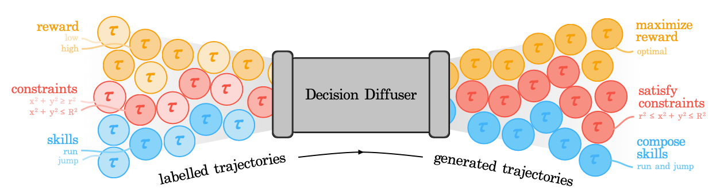
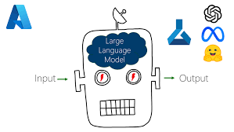
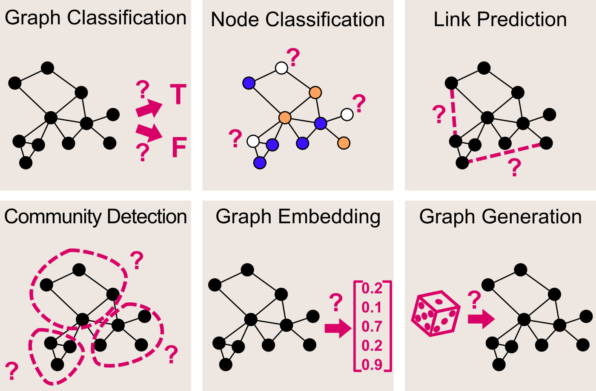

# Welcome to our research

Welcome to our research on applying **generative artificial intelligence (GAI)** in intelligent networks. Two core goals of these efforts are to explore **how intelligent networks can support various artificial intelligence-generated content (AIGC) services**, and **how generative AI can enhance network performance**. In response to the above goals, our research is mainly divided into the following three main topics, i.e., Diffusion Reinforcement Learning, Large Language Models, and Diffusion Graph Generation. In addition, our research also includes Semantic Communication, Resource Allocation, Integrated Sensing and Communication (ISAC), and Metaverse applications integrated into the GAI.

# Recommended Publications

  

    
  

  

    <b>Beyond Deep Reinforcement Learning: A Tutorial on Generative Diffusion Models in Network Optimization</b> 
    Hongyang Du, Ruichen Zhang, Yinqiu Liu, Jiacheng Wang, Yijing Lin, Zonghang Li, Dusit Niyato, Jiawen Kang, Zehui Xiong, Shuguang Cui, Bo Ai, Haibo Zhou, Dong In Kim 
    <em>IEEE COMST</em> 
    

      <em>
         
        <b class="publication-title">The first tutorial paper to explain various applications of diffusion models and coding examples.</b>
      </em> 
       
      <a href="https://arxiv.org/pdf/2308.05384.pdf">Paper</a> |
       
      <a href="https://hongyangdu.github.io/GDMOPT/">Code</a> |
      
      <a href="https://www.youtube.com/watch?v=-vK1eNtSxOA&t=697s&ab_channel=DurAIn-Tech">YouTube</a> |
      
      <a href="https://www.bilibili.com/video/BV1Dm4y157yg/?spm_id_from=333.999.0.0">Bilibili</a>
    

  

<!-- Publication 2 -->

  

    
  

  

    <b>Generative AI for Space-Air-Ground Integrated Networks (SAGIN)</b> 
    Ruichen Zhang, Hongyang Du, Dusit Niyato, Jiawen Kang, Zehui Xiong, Abbas Jamalipour, Ping Zhang, Dong In Kim 
    <em>IEEE Wireless Communications Magazine</em> 
    

      <em>
         
        <b class="publication-title">This paper explores an integration of generative AI in SAGIN, focusing on potential applications and case study.</b>
      </em> 
       
      <a href="https://arxiv.org/pdf/2311.06523.pdf">Paper</a> |
      
      <a href="https://www.youtube.com/watch?v=cQ2vA4rOHME">YouTube</a> |
      
      <a href="https://www.bilibili.com/video/BV1fT4y1s7Eq/?spm_id_from=333.337.search-card.all.click">Bilibili</a>
    

  

<!-- Publication 3 -->

  

    
  

  

    <b>AI-Generated Incentive Mechanism and Full-Duplex Semantic Communications for Information Sharing</b> 
    Hongyang Du, Jiacheng Wang, Dusit Niyato, Jiawen Kang, Zehui Xiong, Dong In Kim 
    <em>IEEE Journal on Selected Areas in Communications</em> 
    

      <em>
         
        <b class="publication-title">This paper proposes a contract theoretic AI-generated incentive mechanism that generates the optimal contract design.</b>
      </em> 
       
      <a href="https://arxiv.org/pdf/2303.01896.pdf">Paper</a> |
       
      <a href="https://hongyangdu.github.io/SemSharing/">Code</a>
    

  

<!-- Publication 4 -->

  

    
  

  

    <b>Generative AI for Integrated Sensing and Communication: Insights from the Physical Layer Perspective</b> 
    Jiacheng Wang, Hongyang Du, Dusit Niyato, Jiawen Kang, Shuguang Cui, Xuemin Shen, Ping Zhang 
    <em>IEEE Wireless Communications Magazine</em> 
    

      <em>
         
        <b class="publication-title">The paper showcases the use of generative AI in integrated sensing and communications, especially from physical layer.</b>
      </em> 
       
      <a href="https://arxiv.org/pdf/2310.01036.pdf">Paper</a> |
      
      <a href="https://www.youtube.com/watch?v=ZqSmgw0XOXo&ab_channel=DurAIn-Tech">YouTube</a> |
      
      <a href="https://www.bilibili.com/video/BV1v84y1m7kn/?spm_id_from=333.999.0.0">Bilibili</a>
    

  

# Main topics

  <a href="./another-page.html" style="display:inline-block; margin-right:10px; width:30%;">
    
     Diffusion Reinforcement Learning
  </a>

  <a href="./another-page2.html" style="display:inline-block; margin-right:10px; width:30%;">
    
     Interactive AI Agent
  </a>

  <a href="./another-page3.html" style="display:inline-block; width:30%;">
    
     Resource Allocation
  </a>

# Main Topics

  <a href="./another-page.html" class="info-box">
    
    
Diffusion Reinforcement Learning

  </a>

  <a href="./another-page2.html" class="info-box">
    
    
Interactive AI Agent

  </a>

  <a href="./another-page3.html" class="info-box">
    
    
Resource Allocation

  </a>

# Main Topics

  <a href="./another-page.html" class="info-box">
    
    
Diffusion Reinforcement Learning

  </a>

  <a href="./another-page2.html" class="info-box">
    
    
Interactive AI Agent

  </a>

  <a href="./another-page3.html" class="info-box">
    
    
Resource Allocation

  </a>

# Update Publications

<!-- Publication 1 -->

  

    
  

  

    <b>Fusion of Mixture of Experts and Generative Artificial Intelligence in Mobile Edge Metaverse</b> 
    Guangyuan Liu, Hongyang Du, Dusit Niyato, Jiawen Kang, Zehui Xiong, Abbas Jamalipour, Shiwen Mao, Dong In Kim 
    <em>Under Review</em> 
    

      <em>
         
        <b class="publication-title">The paper explores the potential of mixture of experts with generative AI, focusing on mobile edge Metaverse.</b>
      </em> 
       
      <a href="https://arxiv.org/abs/2404.03321">Paper</a> |
       
      <a href="https://alvinliu97.github.io/MOEGAI-metaverse/">Code</a>
    

  

<!-- Publication 2 -->

  

    
  

  

    <b>Generative AI Agent for Next-Generation MIMO Design: Fundamentals, Challenges, and Vision</b> 
    Zhe Wang, Jiayi Zhang, Hongyang Du, Ruichen Zhang, Dusit Niyato, Bo Ai, Khaled B. Letaief 
    <em>Under Review</em> 
    

      <em>
         
        <b class="publication-title">This paper studies the generative AI agent for next-generation MIMO design.</b>
      </em> 
       
      <a href="https://arxiv.org/pdf/2404.08878.pdf">Paper</a> |
       
      <a href="https://zhewang77.github.io/GAIMIMO/">Code</a>
    

  

<!-- Publication 3 -->

  

    
  

  

    <b>Generative AI for Game Theory-based Mobile Networking</b> 
    Long He, Geng Sun, Dusit Niyato, Hongyang Du, Fang Mei, Jiawen Kang, Mérouane Debbah, Zhu Han 
    <em>Under Review</em> 
    

      <em>
         
        <b class="publication-title">The paper explores the combination of LLM with game theory, focusing on mobile network optimization.</b>
      </em> 
       
      <a href="https://arxiv.org/abs/2404.09699">Paper</a>
    

  

<!-- Publication 4 -->

  

    
  

  

    <b>Toward Scalable Generative AI via Mixture of Experts in Mobile Edge Networks</b> 
    Jiacheng Wang, Hongyang Du, Dusit Niyato, Jiawen Kang, Zehui Xiong, Dong In Kim, Khaled B. Letaief 
    <em>Under Review</em> 
    

      <em>
         
        <b class="publication-title">This paper proposes mobile edge networks supported MoE-based GAI.</b>
      </em> 
       
      <a href="https://arxiv.org/pdf/2402.06942.pdf">Paper</a> |
       
      <a href="https://hongyangdu.github.io/Net4MoE/">Code</a>
    

  

# Group Members

<table>
  <tr>
    <td align="center">
       
      Hongyang Du
    </td>
    <td align="center">
       
      Ruichen Zhang
    </td>
    <td align="center">
       
      Jiacheng Wang
    </td>
    <td align="center">
       
      Yinqiu Liu
    </td>
  </tr>
  <tr>
    <td align="center">
       
      Guangyuan Liu
    </td>
    <td align="center">
       
      Changyuan Zhao
    </td>
    <td align="center">
       
      Jingyang Cao
    </td>
    <td align="center">
       
      Zhe Wang
    </td>
  </tr>
  <!-- 更多成员 -->
</table>

